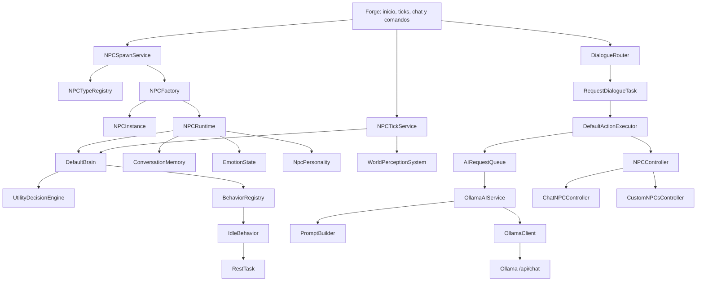
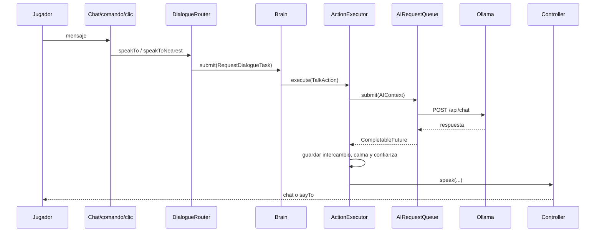

# Análisis completo del proyecto SamuraiAI

**Fecha del análisis:** 15 de septiembre de 2026  
**Proyecto:** mod Forge para Minecraft 1.19.2 que añade NPCs con cerebro modular, diálogo mediante Ollama e integración opcional con CustomNPCs.  
**Alcance revisado:** configuración Gradle/Forge, las 99 clases de `src/main/java`, los 58 stubs de `src/customnpcs-api/java`, recursos, dependencias locales, registros de ejecución, compilación y las 11 imágenes de `visualizarimganes`.

> Nota: la carpeta se llama realmente `visualizarimganes` (falta la segunda “e” de “imagenes”). En este documento se conserva el nombre real para que los enlaces funcionen.

## 1. Resumen ejecutivo

SamuraiAI tiene una **base arquitectónica bien separada**: dominio de NPC, cerebro, decisión, comportamiento, tareas, acciones, controladores físicos, percepción, memoria, emociones, relaciones, prompts, proveedor de IA y eventos. El diálogo con Ollama está conectado desde el chat/comando hasta la respuesta del NPC y existe una integración concreta que crea avatares de CustomNPCs.

Sin embargo, el producto está todavía en una **fase de prototipo funcional centrado en conversación**, no en una IA completa de NPC:

- Compila correctamente, pero no tiene pruebas automatizadas.
- `TALK` es la única acción ejecutada. Movimiento, patrulla, combate, defensa, seguimiento y huida son enums o puntos de extensión sin ejecución física.
- Todos los objetivos usan `IdleBehavior` como fallback porque no hay behaviors dedicados registrados; este produce un `RestTask` que termina inmediatamente.
- La percepción solo detecta jugadores por distancia. No comprueba línea de visión, audición, enemigos, mobs, bloques ni eventos de combate.
- La memoria es únicamente una ventana de conversación en RAM. No existe memoria persistente en disco, memoria semántica, lugares visitados, hechos importantes ni restauración al cargar el mundo.
- El bus de eventos funciona técnicamente, pero la mayoría de los eventos definidos nunca se publican ni tienen consumidores.
- La clase `AIRequestQueue` no mantiene una cola: cuando se ocupan todos los permisos, descarta la solicitud.
- Hay riesgos importantes de concurrencia: la respuesta HTTP modifica estado y llama a APIs de Minecraft desde el hilo de finalización asíncrono.
- El registro disponible contiene un arranque fallido de CustomNPCs. La causa observable incluye `versionRange = ""` para la dependencia opcional y un Mixin que no pudo localizar un campo remapeado.
- Faltan elementos básicos de mantenimiento: `README.md`, `.gitignore`, archivo de licencia, estructura estándar de pruebas y metadatos Git en esta copia.

### Evaluación general

| Área | Estado | Valoración |
|---|---:|---|
| Arquitectura y separación de responsabilidades | Buena | Interfaces y límites claros; facilita completar el motor después. |
| Compilación | Correcta | `BUILD SUCCESSFUL`; dos avisos de deprecación. |
| Diálogo con Ollama | Funcional con riesgos | Flujo completo, prompt contextual y límites razonables; concurrencia y orden requieren corrección. |
| Integración CustomNPCs | Parcial/inestable | Implementada en código, pero el último registro muestra fallo fatal de arranque. |
| Decisión autónoma | Esqueleto | Puntúa goals, pero no produce acciones físicas útiles. |
| Memoria y relaciones | Parcial | Conversación y puntuaciones en RAM; sin persistencia real. |
| Percepción | Parcial | Jugadores cercanos y hora; no línea de visión, enemigos ni mundo físico. |
| Eventos | Infraestructura parcial | Bus robusto, pero eventos importantes están desconectados. |
| Pruebas | Insuficiente | No hay tests JUnit/GameTests; únicamente dos `main` manuales. |
| Preparación para distribución | Baja | Falta documentación, licencia material, limpieza de artefactos y prueba de servidor real. |

## 2. Inventario técnico

### Plataforma

- Java 17.
- Minecraft 1.19.2.
- Forge 43.5.2.
- ForgeGradle 6.x.
- Gradle Wrapper configurado para 8.14.5.
- Gson como `compileOnly`, proporcionado en ejecución por Minecraft.
- Ollama por HTTP usando `java.net.http.HttpClient`.
- CustomNPCs 1.19.2 GBPort Unofficial, jar local de julio de 2025.

### Tamaño y composición

| Zona | Contenido observado |
|---|---:|
| `src/main/java` | 99 archivos Java, aproximadamente 4.8 mil líneas. |
| `src/customnpcs-api/java` | 58 archivos de API/stubs usados para compilar. |
| `libs/CustomNPCs` | 1,538 archivos extraídos del mod de terceros. |
| `libs` | Aproximadamente 21.94 MB. |
| Imágenes analizadas | 11 PNG, aproximadamente 0.33 MB. |
| Pruebas estándar en `src/test` | 0. |

### Dependencias y artefactos locales

- `CustomNPCs-1.19.2-GBPort-Unofficial-20250701.jar` sí aparece en `build.gradle` mediante `fg.deobf` y `flatDir`.
- `discrimine0-0.1-SNAPSHOT.jar` estaba en `libs` sin referencias; se retiró durante la limpieza de Fase 1 y queda registrado en `docs/phase1/PHASE1_CHANGELOG.md`.
- `libs/CustomNPCs` parece una extracción completa del jar y no una entrada del build. Duplica mucho contenido y hace más difícil distinguir código propio de código de terceros.
- No hay repositorio Git reconocible en esta copia (`git status` devolvió “not a git repository”).

## 3. Arquitectura implementada



### Flujo de creación

1. `/samuraiai spawn <type> [name]` exige nivel de operador 2.
2. El comando crea `NPCSpawnRequest` con dimensión y posición del jugador.
3. `NPCSpawnService` valida límite y tipo.
4. `NPCFactory` crea identidad, instancia, cerebro, memoria conversacional, emoción y personalidad individualizada.
5. El controlador crea el cuerpo físico o acepta un NPC sin cuerpo.
6. Se registra `NPCRuntime`, cambia el lifecycle a `ACTIVE` y se publica `NPCSpawnedEvent`.

### Flujo de pensamiento

1. `NPCTickService` se ejecuta en la fase `END` del tick de servidor.
2. Los cerebros se escalonan y usan un intervalo configurable, 20 ticks por defecto.
3. `WorldPerceptionSystem` crea un `WorldContext` con jugadores próximos y hora del mundo.
4. `UtilityDecisionEngine` puntúa los objetivos por prioridad, emociones y presencia de jugadores.
5. `BehaviorRegistry` busca un behavior para el objetivo.
6. En el estado actual no hay registros dedicados; siempre cae en `IdleBehavior` → `RestTask` → `SUCCESS`.

### Flujo de diálogo



Este flujo existe y es la parte más completa del proyecto. El problema es que el último tramo ocurre desde el hilo de finalización HTTP y no se reprograma explícitamente en el hilo del servidor.

## 4. Estado por módulo

| Módulo | Qué existe | Qué falta o limita su uso |
|---|---|---|
| Inicio Forge | Registro de config, eventos de servidor y logs. | APIs `get()` de Forge marcadas para eliminación. |
| Tipos de NPC | Samurai, guardia y mercader con capacidades y goals. | Carga desde datos/config, validación y extensibilidad externa. |
| Spawn/lifecycle | Servicio único, factory, límite, alta/baja y eventos. | Reactivación real, chunks, muerte, guardado/carga y unicidad de nombres pedidos. |
| Cerebro | Tick, work queue urgente, goal actual y manejo aislado de errores. | Replanificación real, cancelación/prioridades de tareas, trazabilidad del score. |
| Decisión | Utility scoring legible. | Salud, hambre, hostilidad, amenazas, relaciones y contexto de combate. |
| Behaviors | Interfaz, registry y fallback idle. | No hay behaviors dedicados para ningún goal. |
| Tasks | `RestTask` y `RequestDialogueTask`. | Movimiento, vigilancia, combate, seguimiento, comercio, huida. |
| Actions | Enum amplio y `TalkAction`. | Solo `TALK` se ejecuta; las demás se registran como pendientes. |
| Percepción | Jugadores por radio/dimensión y hora del mundo. | Línea de visión, audición, mobs, enemigos, obstáculos, eventos de entrada/salida. |
| Personalidad | Base por tipo + quirk aleatorio. | Persistir el quirk; modelo de rasgos estructurados. Al reiniciar cambiaría. |
| Emociones | Diez emociones, baseline, clamp y decay thread-safe. | Casi ningún estímulo las modifica; actualmente una charla exitosa solo suma `CALM`. |
| Relaciones | Cinco ejes de -100 a 100, descripción textual. | Solo aumenta confianza tras charla exitosa; no se persiste ni afecta decisiones. |
| Memoria | Ventana limitada y thread-safe de mensajes recientes. | Memoria temporal/persistente de diseño, resumen, hechos, reputación, lugares y disco. |
| Eventos | Bus con supertipos y aislamiento de listeners. | Eventos de daño/aproximación/emoción/relación no se publican; no existen los de combate de las imágenes. |
| Ollama | Cliente async, timeout HTTP, prompt modular, historial con roles, limpieza de respuesta. | Verificación de modelo, cancelación efectiva, autenticación remota, orden por NPC. |
| Controladores | Chat y CustomNPCs para spawn/speak/remove/interact. | Sin sincronizar movimiento/posición ni despawn externo; fallback puede ocultar fallo del avatar. |
| Persistencia | Interfaz y `InMemoryNPCPersistence`. | La implementación no se usa y no persiste fuera de la JVM. |
| Operación | Comandos spawn/remove/talk/list/types/status. | Métricas más completas, diagnóstico de modelo, comandos de depuración y documentación de uso. |

## 5. Análisis de las imágenes

### 5.1 Ciclo de vida de un NPC


La imagen propone `SpawnRequest → NPCSpawnService → NPCTypeRegistry → NPCFactory → NPCInstance → NPCRuntime → NPCController`. Este flujo coincide bastante bien con el código. La diferencia principal es que `NPCController` también participa durante la creación física antes de que el runtime quede registrado. El lifecycle interno añade `CREATING`, `INITIALIZING`, `ACTIVE`, `UNLOADING`, `INACTIVE` y `REMOVED`, pero esos estados no se persisten.

### 5.2 Arquitectura general


La separación Brain → sistemas internos → controlador → integración → CustomNPCs se refleja en los paquetes. La imagen es una buena vista conceptual, pero presenta como sistemas operativos componentes que hoy son parciales: scheduler es solo el tick service, relations no influyen en la decisión, memory no es persistente, behaviors/tasks casi no tienen implementaciones y la integración física no ejecuta movimiento o combate.

### 5.3 Los tres pilares


- **SamuraiAI:** sí concentra decisión, estado, contexto y diálogo.
- **CustomNPCs:** aporta el cuerpo, nombre/título, `say/sayTo`, interacción y despawn; todavía no recibe decisiones de movimiento o combate.
- **Ollama:** se usa para lenguaje. El código correctamente no lo convierte en el cerebro de utility AI.

La separación es conceptualmente sólida y evita usar el LLM en cada tick.

### 5.4 Cómo piensa un NPC


El pipeline existe nominalmente, pero no completo:

- Percepción: solo jugadores cercanos.
- Memoria: historial corto de conversación.
- Relaciones: disponibles para el prompt, no para el goal scoring.
- Emoción: disponible para scoring y prompt, con estímulos mínimos.
- Objetivos/decisión: implementados.
- Behavior/task/action: solo descanso inmediato y conversación producen algo; no existe el resto del motor físico.

### 5.5 Sistema de memoria


La imagen define memoria temporal y persistente. El código solo implementa una ventana temporal de mensajes (`ConversationMemory`) y un mapa en RAM (`MemoryManager`). Las relaciones están en `NPCInstance`, pero también desaparecen cuando se pierde la instancia. No se guardan jugadores conocidos, reputación, eventos, lugares o recuerdos positivos. Por tanto, el ejemplo de reconocer al jugador días después solo funciona dentro de la misma sesión y mientras el mismo objeto siga accesible.

### 5.6 Personalidad frente a emociones


Esta separación sí está bien representada en el modelo: `NpcPersonality` es estable durante el runtime y `EmotionState` cambia y decae. No obstante, la personalidad individual se genera aleatoriamente en cada creación y no se guarda; las emociones tampoco se restauran. Además, casi ningún evento del juego alimenta todavía las emociones.

### 5.7 Goals, Behaviors, Tasks y Actions


Las cuatro abstracciones existen, pero la ilustración muestra un `GuardBehavior`, tareas de patrulla y acciones `MoveTo/LookAt/Attack/Follow/Flee` que no existen como clases ejecutables. Solo están sus valores en `ActionType`. `DefaultActionExecutor` implementa `TALK`; todo lo demás cae en un log de “seam pendiente”. Esta es la mayor diferencia entre el diseño visual y el producto actual.

### 5.8 Sistema de eventos


Existe `NPCEventBus` y publica mensajes, spawn, remove y creación de memoria. `PlayerApproachEvent`, `NpcDamagedEvent`, `EmotionChangedEvent` y `RelationshipChangedEvent` están definidos pero no se publican. `CombatStartedEvent` y `CombatEndedEvent` ni siquiera existen. Los nombres de la imagen tampoco coinciden exactamente con el código (`PlayerDetectedEvent`/`PlayerSpokeEvent`/`DamageReceivedEvent`).

### 5.9 Integración con Ollama


El flujo Brain → request/task → `AIRequestQueue` → `AIService` → Ollama → `AIResponse` → controlador está implementado. La salvedad es semántica: `AIRequestQueue` es un limitador de concurrencia con descarte, no una cola FIFO. Tampoco serializa peticiones del mismo NPC, por lo que dos respuestas pueden terminar en orden inverso.

### 5.10 Diálogo inteligente


El prompt incluye identidad, tipo, personalidad, emociones, relación, jugadores cercanos, hora e historial. No incluye “conocimiento” o localizaciones conocidas como propone la imagen. La conversación conserva roles `user` y `assistant`, limita la entrada a 500 caracteres por defecto y la salida a 300 caracteres.

### 5.11 Metodología de desarrollo


El repositorio parece haber avanzado por las fases 1–5 y partes de 6–10, 12 y 13. No puede considerarse terminada la secuencia porque behaviors/actions físicas, persistencia y pruebas de integración siguen pendientes. La fase 13 tiene una integración básica con Ollama, pero aún requiere robustez operativa.

## 6. Hallazgos priorizados

### P0 — Bloqueantes de ejecución o integridad

#### 1. CustomNPCs presenta un fallo fatal de arranque en el registro disponible

Evidencia:

- `src/main/resources/META-INF/mods.toml:71` declara `versionRange = ""`.
- `run/logs/latest.log` informa `Unsupported installed optional dependencies` para `customnpcs`, con rango esperado vacío.
- El mismo log termina con `Mixin apply failed` e `InvalidAccessorException` para `EntityIMixin` y el campo `f_146795_`.

El `build.gradle` intenta resolver el problema de remapeo usando `flatDir` + `fg.deobf`, lo cual es razonable, pero no existe una ejecución posterior documentada que demuestre un arranque limpio. Hay que corregir el rango, regenerar las configuraciones de ejecución y probar cliente y servidor con la versión exacta del jar.

#### 2. La entrega de diálogo toca Minecraft desde un hilo HTTP

`DefaultActionExecutor` usa `thenAccept(response -> onReply(...))`. Dentro de `onReply` llama `controller.speak`; `ChatNPCController` recorre niveles/jugadores y envía mensajes, mientras `CustomNPCsController` llama `npc.sayTo`/`npc.say`. Estas operaciones deberían volver al hilo del servidor mediante `MinecraftServer#execute`.

El propio comando `status` ya aplica correctamente ese patrón en `SamuraiCommand#probeOllama`, lo que confirma la forma esperada de hacerlo.

Riesgos: carreras, acceso concurrente a entidades/levels, errores intermitentes y corrupción difícil de reproducir.

#### 3. Una respuesta pendiente puede hablar después de eliminar el NPC

Las solicitudes no se cancelan al retirar el NPC y `onReply` conserva referencias al runtime/controlador. Si la respuesta llega tarde, puede guardar memoria y emitir una línea de un NPC ya eliminado. En CustomNPCs, al no hallar avatar, el controlador cae en chat normal, haciendo posible un “NPC fantasma”.

### P1 — Alta prioridad funcional

#### 4. El motor de comportamiento no ejecuta la visión del proyecto

`DefaultBrain` crea un `BehaviorRegistry` vacío. Para cualquier goal, `forGoal` devuelve `IdleBehavior`, que crea un `RestTask`; este responde `SUCCESS` de inmediato. El estado y el goal pueden decir `PATROLLING`, `FLEE` o `PROTECT`, pero el mundo no cambia.

#### 5. La “cola” de IA descarta en vez de encolar

`AIRequestQueue:70` usa `Semaphore#tryAcquire`. Si no hay permiso, aumenta `dropped` y devuelve fallo. Para que el diagrama sea cierto hace falta una cola acotada, política de backpressure, límite por jugador/NPC y métricas de espera.

Además, `orTimeout` completa el future con timeout, pero no garantiza cancelar el HTTP/Ollama subyacente. Como el timeout de IA por defecto es 30 s y el HTTP 60 s, el permiso puede liberarse mientras el trabajo anterior aún consume recursos; bajo timeouts, el límite efectivo de carga puede romperse.

#### 6. Peticiones simultáneas del mismo NPC pueden responder fuera de orden

El cooldown es por jugador, no por NPC. Dos jugadores pueden activar el mismo NPC a la vez. Las respuestas se guardan en el orden en que terminan, no en el orden de las preguntas, y cada prompt puede partir del mismo historial anterior. Se necesita serialización por NPC o un identificador de turno con descarte/reordenamiento.

#### 7. No existe persistencia real y la memoria retenida al apagar queda inaccesible

`NPCPersistence`/`InMemoryNPCPersistence` no tienen usos fuera de sus propias definiciones. En el apagado se retiran NPCs con `forget=false`, pero luego se limpia `NPCManager`; no se guardan sus identidades ni existe ruta de reactivación. `MemoryManager` conserva entradas por UUID que ya no pueden recuperarse mediante un NPC nuevo, creando retención de memoria sin persistencia útil.

También quedan mapas estáticos como el cooldown de `DialogueRouter` y estados de lifecycle sin limpieza completa entre mundos de una misma JVM.

#### 8. La dependencia “opcional” de CustomNPCs merece una prueba sin el mod

`Samuraiai` referencia directamente `CustomNPCsController`, incluso en un `instanceof`. Como el jar de API no se incluye en el artefacto final, debe verificarse que el classloading de JVM/Forge no resuelva clases `noppes.*` cuando CustomNPCs está ausente. La opción más robusta es aislar el compat en una capa cargada por reflexión o entrypoint condicional sin referencias directas desde la clase principal.

### P2 — Calidad y consistencia

#### 9. Eventos declarados pero desconectados

No hay publishers para daño, aproximación, emoción o relaciones. Los cambios de `EmotionState` y `Relationship` no publican los eventos correspondientes. Tampoco hay eventos de inicio/fin de combate. La promesa de desacoplamiento del diagrama todavía no se materializa.

#### 10. Percepción demasiado limitada

El detector usa esfera por distancia dentro de un AABB y solo jugadores. No verifica línea de visión pese a que la documentación habla de lo que el NPC “puede ver”. Tampoco actualiza la posición de `NPCInstance` desde la entidad CustomNPCs; `setLocation` no tiene llamadas. Cuando exista movimiento, percepción, chat y `/list` seguirán usando el punto de spawn.

#### 11. Goals y capacidades tienen inconsistencias de producto

- Samurai y guardia poseen `CAN_FIGHT`, pero sus goals por defecto no incluyen `COMBAT`.
- Mercader incluye `FLEE` con prioridad base 85. Sin amenazas, normalmente gana sobre `REST`/`TALK`, aunque no existe behavior de huida.
- `PROTECT` se traduce al estado por defecto `IDLE`, porque `stateFor` no tiene estado específico.
- Las relaciones no participan en el score, por lo que aliado/enemigo no cambia decisiones.

#### 12. Nombres duplicados y comandos ambiguos

Los nombres autogenerados intentan ser únicos, pero un nombre solicitado por el administrador se acepta sin comprobar duplicados. `findByName` devuelve el primero que encuentre en un `ConcurrentHashMap`, por lo que `talk` y `remove` pueden dirigirse a un NPC no determinista.

#### 13. El fallback de error nunca se habla

`AIResponse.failure` contiene textos como `Ahora no puedo atenderte.`, pero `onReply` exige `success == true` mediante `hasSpeakableText`. Por eso, los fallos y descartes quedan silenciosos para el jugador. Hay que decidir explícitamente entre hablar un fallback controlado o informar el fallo por otro canal.

#### 14. Estado del avatar puede quedar desincronizado

`CustomNPCsController#isPhysicalPresent` solo comprueba que el UUID exista en el mapa, no que la entidad siga viva/presente. Si CustomNPCs, un comando externo o el mundo despawnea la entidad, SamuraiAI conserva una referencia obsoleta.

#### 15. Suscripciones y singletons atraviesan reinicios internos

Cada nuevo `CustomNPCsController` registra `this::onInteract` en el bus de CustomNPCs y no existe `unsubscribe`. En single-player/integrated server, varios arranques en la misma JVM pueden retener controladores antiguos. De forma parecida, stats de IA, cooldowns, memoria y lifecycle no tienen un reset coordinado.

### P3 — Mantenibilidad, documentación y distribución

#### 16. No hay pruebas automatizadas

Gradle confirmó:

```text
compileTestJava NO-SOURCE
test NO-SOURCE
BUILD SUCCESSFUL in 32s
```

`DevelopmentTests` y `NpcSpawnTest` son programas `main` manuales ubicados bajo `src/main/java`; no producen aserciones ni se ejecutan en `check`.

#### 17. Faltan archivos esenciales del repositorio

No se encontraron `README.md`, `.gitignore` ni archivo `LICENSE`. `mods.toml` declara “All Rights Reserved”, pero no existe un texto de licencia material. Tampoco hay documentación de instalación de Ollama, modelo requerido, comandos, configuración, CustomNPCs o limitaciones.

#### 18. Contenido de terceros mezclado con el proyecto

La carpeta extraída `libs/CustomNPCs` contiene código, assets, sonidos y esquemas de terceros. Conviene mantener solo el jar si la licencia lo permite, documentar procedencia/licencia y evitar versionar artefactos extraídos. El jar `discrimine0` debería eliminarse o documentarse si realmente es necesario.

#### 19. Avisos de deprecación Forge

La compilación advierte que `FMLJavaModLoadingContext.get()` y `ModLoadingContext.get()` están marcados para eliminación. No bloquean Forge 1.19.2, pero dificultan una actualización futura.

## 7. Aspectos positivos

- Separación clara entre inteligencia y cuerpo mediante `NPCController`.
- `NPCFactory` concentra la composición del runtime.
- `AIContext` es inmutable y copia colecciones.
- Conversación y relaciones usan sincronización o estructuras concurrentes.
- Entrada de jugador acotada y saneada; salida del modelo limitada.
- Historial enviado con roles reales en lugar de aplanarlo dentro del prompt.
- El cliente HTTP es compartido y maneja códigos HTTP, JSON inválido y errores del modelo.
- El tick de cerebros está escalonado para evitar picos.
- Un fallo de un NPC o listener no detiene todo el servidor.
- El score de utilidad es legible y extensible.
- El prompt separa identidad, personalidad, estado y situación.
- Los comandos administrativos tienen permisos y el chequeo de Ollama no bloquea el hilo principal.
- Los límites principales son configurables y vuelven a validarse al cargar.

## 8. Seguridad, privacidad y robustez

### Controles ya presentes

- Longitud máxima de mensaje configurable.
- Eliminación de caracteres de control.
- Límite de respuesta del modelo.
- Cooldown por jugador.
- Límite de concurrencia.
- Timeouts de conexión, HTTP y capa de IA.
- Advertencia si Ollama apunta a un host no local.
- Los nombres no se usan todavía como rutas de archivo; la interfaz de persistencia ya advierte sobre path traversal futuro.

### Riesgos restantes

- Si `ollama.host` es remoto, los mensajes de jugadores salen de la máquina. No hay consentimiento, TLS obligatorio ni autenticación configurable.
- El prompt del sistema reduce, pero no elimina, prompt injection o salida fuera de personaje.
- No hay filtrado de contenido generado antes de publicarlo en chat.
- La cola saturada no ofrece equidad: una ráfaga puede descartar solicitudes de otros jugadores.
- Los callbacks asíncronos acceden a estado de servidor fuera de hilo.
- Logs pueden conservar texto de conversación y nombres de jugadores.
- No hay límite de memoria total por número de UUID históricos si no se ejecuta `forget`.

## 9. Rendimiento

### Decisiones acertadas

- Intervalo de cerebro configurable y escalonamiento por UUID.
- Distancias al cuadrado donde no se necesita la distancia real.
- Radio de percepción acotado.
- Historial y respuestas limitados.
- `HttpClient` compartido.
- Estructuras concurrentes apropiadas para varias rutas.

### Puntos a medir

- `WorldPerceptionSystem` hace una consulta AABB por NPC en cada tick de cerebro. Con 50 NPCs y radio 24 puede ser aceptable, pero debe perfilarse con carga real.
- Cada NPC vuelve a planificar `RestTask` continuamente; es barato, pero trabajo inútil.
- `CustomNPCsController#findIdFor` recorre linealmente todos los avatares por interacción. Conviene un mapa bidireccional por UUID de entidad.
- Los prompts pueden incluir hasta 200 mensajes si se configura el máximo, sin presupuesto de tokens.
- Los timeouts no garantizan cancelar la inferencia activa de Ollama.
- El LLM recibe una petición por mensaje; no hay agrupación, caché ni prioridad.

## 10. Verificación ejecutada

Se ejecutó `clean check` con Gradle 8.4 disponible en el entorno:

```text
compileCustomNpcsApiJava  OK (con aviso unchecked)
compileJava               OK (2 avisos de deprecación)
processResources          OK
compileTestJava           NO-SOURCE
test                      NO-SOURCE
check                     OK
BUILD SUCCESSFUL in 32s
```

Interpretación: **el código compila**, pero esta verificación no prueba que Forge pueda iniciar con CustomNPCs, que Ollama responda, que un avatar aparezca o que el diálogo se entregue de forma thread-safe.

El `latest.log` disponible es histórico (19 de agosto de 2026 y rutas de otro perfil de usuario). Debe conservarse como pista, no confundirse con una ejecución del análisis actual.

## 11. Hoja de ruta recomendada

### Fase 1 — Hacer arrancable y verificable la base

1. Corregir `versionRange` de CustomNPCs y validar la versión exacta compatible.
2. Ejecutar `runServer`/`runClient` con CustomNPCs y guardar un log limpio.
3. Probar un segundo perfil sin CustomNPCs para confirmar que la integración es realmente opcional.
4. Mover los callbacks de diálogo al hilo del servidor.
5. Añadir tests JUnit y Forge GameTests al `check`.
6. Crear README, `.gitignore`, licencia y guía de instalación.

### Fase 2 — Cerrar correctamente el diálogo

1. Serializar conversaciones por NPC y mantener orden de turnos.
2. Sustituir el descarte inmediato por una cola acotada con timeout de espera.
3. Cancelar o invalidar respuestas cuando se elimina/desactiva un NPC.
4. Definir comportamiento visible de fallback.
5. Verificar que el modelo configurado está instalado, no solo que `/api/tags` responde.
6. Añadir métricas de latencia, cola, cancelación y tokens aproximados.

### Fase 3 — Convertir goals en acciones reales

1. Implementar `MoveToAction` y `LookAtAction` en el adaptador CustomNPCs.
2. Crear `PatrolBehavior` con tareas secuenciales.
3. Añadir detección de amenaza y línea de visión.
4. Crear `InvestigateBehavior`, `FleeBehavior`, `ProtectBehavior` y `CombatBehavior`.
5. Sincronizar posición y estado físico desde el avatar hacia `NPCInstance`.
6. Publicar eventos de aproximación, daño, combate, emoción y relación.

### Fase 4 — Persistencia y memoria de largo plazo

1. Implementar `SavedData`/NBT por mundo.
2. Persistir identidad, tipo, nombre, personalidad individual, posición y relaciones.
3. Separar memoria episódica reciente de hechos resumidos de largo plazo.
4. Restaurar runtimes y avatares al cargar mundo/chunk.
5. Añadir versión de esquema y migraciones.
6. Limpiar singletons por ciclo de servidor y cancelar trabajos en vuelo.

### Fase 5 — Producto y operación

1. Definir compatibilidad y licencia de CustomNPCs.
2. Empaquetar solo los artefactos necesarios.
3. Añadir configuración de privacidad/logging.
4. Probar 1, 10 y 50 NPCs con carga concurrente.
5. Crear matriz de compatibilidad Minecraft/Forge/CustomNPCs/Ollama/modelo.
6. Automatizar build, tests y artefacto release en CI.

## 12. Casos de prueba mínimos

| Nivel | Caso |
|---|---|
| Unitario | Scoring por miedo/ira/calme y desempates de goals. |
| Unitario | Trimming atómico de memoria y orden de conversaciones concurrentes. |
| Unitario | Saneamiento y límites de mensajes/respuestas. |
| Unitario | Semáforo/cola: éxito, fallo síncrono, future nulo, timeout y resize. |
| Unitario | Nombres duplicados y búsqueda determinista. |
| Integración | Spawn/remove de los tres tipos con controlador fake. |
| Integración | Eliminar NPC mientras Ollama tiene una respuesta en vuelo. |
| Integración | Dos jugadores hablan al mismo NPC y las respuestas mantienen orden. |
| GameTest | Tick del cerebro en fase END y escalonamiento. |
| GameTest | Percepción por dimensión, radio y línea de visión. |
| GameTest | Avatar CustomNPCs aparece, habla, se mueve y desaparece. |
| Arranque | Forge con CustomNPCs presente. |
| Arranque | Forge sin CustomNPCs presente. |
| Persistencia | Guardar mundo, reiniciar y verificar identidad/memoria/relación. |
| Carga | 50 NPCs, ráfaga de chat, timeouts y recuperación de permisos. |

## 13. Criterio de “versión funcional”

Para considerar SamuraiAI una primera versión funcional y coherente con las imágenes deberían cumplirse, como mínimo:

- Arranque reproducible con y sin CustomNPCs.
- Cero acceso a Minecraft desde hilos HTTP.
- Una cola real o una política explícita de backpressure.
- Orden conversacional por NPC y cancelación al eliminarlo.
- Al menos patrulla y movimiento físicos completos.
- Percepción de amenazas y publicación de eventos esenciales.
- Persistencia de identidad, personalidad, relaciones y memoria resumida.
- Tests automáticos ejecutados por `gradle check`.
- README de instalación/uso y dependencias/licencias claras.

## 14. Conclusión

El proyecto no es una colección desordenada de pruebas: posee una arquitectura deliberada y varias decisiones técnicas buenas. Su núcleo realmente operativo es **spawn + runtime + tick + conversación contextual con Ollama + avatar básico CustomNPCs**. El resto de la visión —NPCs que perciben amenazas, recuerdan durante días, construyen relaciones persistentes y convierten objetivos en movimiento/combate— está representado principalmente por interfaces, enums y eventos todavía desconectados.

La prioridad no debería ser añadir más abstracciones, sino cerrar verticalmente tres recorridos reales: **arranque estable**, **diálogo thread-safe y ordenado**, y **un behavior físico completo (patrulla)**. Después de eso, persistencia y eventos permitirán que las imágenes dejen de ser solo arquitectura objetivo y describan el comportamiento observable del mod.
